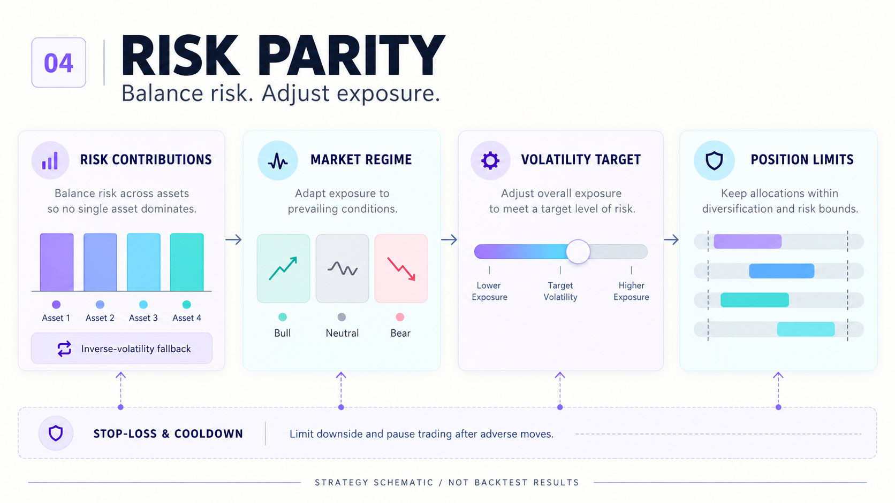

# 增强风险平价 ETF 策略

**风险贡献权重 · 市场状态调整 · 波动率目标 · 仓位约束**



保留原 vn.py `EnhancedRiskParityStrategy`。基础权重通过协方差风险贡献迭代计算；
关闭风险平价或遇到异常条件时使用逆波动率权重，随后按原逻辑进行市场状态与风险暴露调整。

| 模块 | 原代码实际行为 |
| :--- | :--- |
| 基础配置 | 风险平价／逆波动率；60或30日等窗口由配置决定 |
| 市场状态 | 默认200日均线与20日均线、最新价格共同判断 |
| 波动率控制 | 调整风险暴露；不同资金模式采用不同缩放方式 |
| 持仓约束 | 总仓位和单只 ETF 上限；成交后更新现金估算 |
| 调仓 | 日历日期差达到间隔，或权重偏离触发；每天最多一次 |
| 风控 | 峰值回撤、近期移动止损、可选动态收紧与冷却 |

Notebook 有风险平价开启和关闭两种配置，新增入口默认使用第一段配置，其他配置分别保存。
原实现使用300根 `ArrayManager`，需要准备足够历史数据，不能把短示例无成交误认为代码失效。

## 快速运行

```bash
python -m pip install -r requirements.txt
python -m local.run --demo --output runs/demo_risk_parity
```

该命令通过独立轻量适配器加载原策略，使用640个业务日的人工数据，只验证可运行路径。
使用真实行情与原生 vn.py 引擎：

```bash
python -m pip install -r requirements-vnpy.txt
python -m local.run_vnpy --prices /path/to/prices.csv --output runs/native_risk_parity
```

原 vn.py 数据库、`close_price.xlsx` 没有随包提供。新增原生入口直接从 CSV 载入原生回测引擎，
不要求把策略复制到第三方安装包的 `my_strategies` 目录。

## 原研究与参数

- [原 Notebook](RiskParityETFStrategy/RiskParityETFStrategy.ipynb)
- [原研究文档](RiskParityETFStrategy/风险平价策略.docx)
- [全部参数对照](docs/PARAMETERS.md)
- 原实现：`RiskParityETFStrategy/risk_parity_strategy.py`

## 阅读与复现

| 文件 | 用途 |
| :--- | :--- |
| [Quickstart.ipynb](Quickstart.ipynb) | 新增的引导式运行入口；原 Notebook 保留 |
| [PROJECT_OVERVIEW.html](PROJECT_OVERVIEW.html) | 可直接用浏览器打开的离线项目介绍页 |
| [docs/REPRODUCE.md](docs/REPRODUCE.md) | 环境、数据格式、运行与输出说明 |
| [docs/IMPLEMENTATION_NOTES.md](docs/IMPLEMENTATION_NOTES.md) | 代码实际行为、文档差异及复现边界 |
| [docs/VALIDATION.md](docs/VALIDATION.md) | 本次验证结果与未验证事项 |
| [docs/ORIGINAL_README.md](docs/ORIGINAL_README.md) | 完整保留的原 README，包含原报告的历史指标 |
| [CHANGELOG.md](CHANGELOG.md) | 修改范围 |

新增运行结果写入 `runs/`：每日权益、交易记录、参数与数据 SHA-256 指纹、日志，以及表格式 HTML 报告。
已存在的非空输出目录会被拒绝覆盖，请为每次运行指定新的 `--output`。

## 保留策略逻辑

原策略、引擎、组合账本和分析模块的 `.py` 源码逐字保留。新增代码放在 `local/`，不优化参数，不新增交易规则。
原 Notebook 代码单元、输出与执行计数保留，只在顶部补充导航说明。原 PDF／Word 研究资料保留。
`docs/original_manifest.json` 记录原文件哈希及保留位置，可用 `python -m local.verify_originals` 检查源码和原 Notebook 代码完整性。

teaser 是用户已批准的策略示意图，不代表回测结果。人工数据只作为明确选择 `--demo` 的运行夹具；
原报告指标、人工演示结果和真实数据运行结果分别标注，不互相替代。
